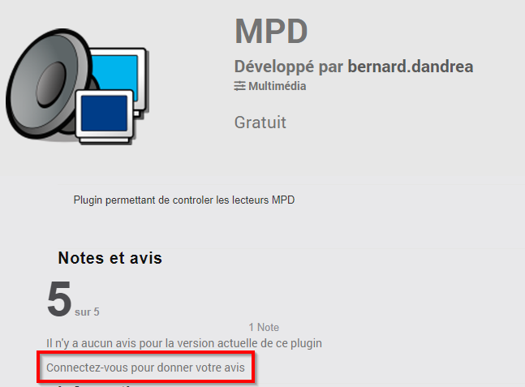

# Plugin MPD

Plugin permettant de contrôler un lecteur MPD.

Music Player Daemon, ou MPD, est un lecteur audio libre qui permet l'accès distant depuis un autre ordinateur. Il se trouve en background de nombreux serveurs multimedia comme moodeaudio, volumio, ...

MPD permet de diffuser les fichiers audio (= Song) qui se trouvent dans sa queue (= Queue). Celle-ci est alimentée par les playlists (les playlists ne sont pas gérées par le plugin). 

Le plugin permet d'exécuter les fonctions de base (chargement de playlist, lecture, volume, ...) à partir de jeedom. Le plugin utilise l'utilitaire mpc pour exécuter les commandes sur le serveur MPD que celui-ci soit en local ou distant. Le package mpc est installé lors de l'activation du plugin.

# Installation et configuration du serveur MPD

Le bon fonctionnement du plugin suppose que le serveur MPD soit opérationnel. 

Celui-ci est le plus souvent installé de façon transparente par le serveur multimedia correspondant (volumio, moodeaudio, ...).

Par défaut, le serveur MPD attend les commandes sur le port 6600. Son accès peut être controlé par un mot de passe.

# Configuration du plugin

Une fois le plugin installé, il faut l'activer.

On peut activer le niveau de log Debug pour suivre l'activité du plugin et identifier les éventuels problèmes.

# Configuration des équipements

La configuration des équipements est accessible à partir du menu du plugin (menu Plugins, Multimedia puis MPD). 

Cliquer sur Ajouter pour définir un nouveau controleur MPD.

Indiquer la configuration du MPD :

-   **Nom** : nom du MPD
-   **Objet parent** : indique l’objet parent auquel appartient l’équipement
-   **Catégorie** : indique la catégorie Jeedom de l’équipement, Multimedia par défaut
-   **Activer** : permet de rendre l'équipement actif
-   **Visible** : le rend visible sur le dashboard
-   **Adresse IP** : IP du serveur MPD, laisser à blanc si installé sur le serveur jeedom
-   **Port** : port d'écoute du serveur MPD, laisser à blanc si valeur par défaut
-   **Mot de passe** : mot de passe pour l'accès au serveur MPD

Les boutons suivants permettent les fonctions suivantes:

-   **Tester la connexion au MPD** :  permet de tester si les paramètres de connexion sont corrects (penser à sauvegarder la configuration avant de cliquer sur le bouton).
-   **Générer les commandes** :  permet de générer les commandes permettant de controler le lecteur (utile uniquement si on a supprimé une des commandes).

# Commandes associées aux équipements

Les commandes de base sont générées lors de la création de l'équipement.

Pour chaque commande de type action, le champ Commande (stocké dans le LogicalID de la commande jeedom) indique la commande transmise à l'utilitaire mpc. Se reporter à la documentation de mpc pour plus d'information ( <https://helpmanual.io/help/mpc/> ).

La commande 'Créer une commande' permet d'ajouter une action, par exemple pour ajouter un racourci pour jouer une station radio. Pour cela, on peut utiliser la commande 'playsong' qui sera transformée en 'play' suivi du numéro de la song dans la Queue.    

# Widget

La présentation créée par défaut permet d'exécuter les fonctions de base. Noter le bouton 'refresh' (en haut à gauche du widget) qui permet d'actualiser l'état du lecteur MPD (playlists, song en cours, ...). En sélectionnant une playlist, on initialise la Queue de MPD avec les Songs correspondantes. La sélection d'une Song permet de la jouer.

La présentation est réalisée à l'aide de la fonction Disposition de l'équipement (dans 'Configuration avancée').

En modifiant, la présentation, on peut ajouter des racourcis. 

# Pilotage du lecteur audio à partir d'un Mi Cube

En utilisant les scénarios, il est possible de piloter son lecteur audio sans utiliser l'interface de Jeedom, à partir d'un périphérique de commande comme le Mi Cube de Xiaomi par exemple.

Le scenario ci-dessus, activé sur le changement d'état de #[Aucun][Cube][side]#, permet de changer la station radio, en changeant le coté du Mi Cube.

Le scenario ci-dessus, activé sur le changement d'état de #[Aucun][Cube][Button]#, permet d'arrêter et redémarrer la chanson en secouant le Mi Cube.

# Avis

Si vous appréciez ce plugin, merci de laisser une évaluation et un commentaire sur le Jeedom market, ça fait toujours plaisir: <https://jeedom.com/market/index.php?v=d&p=market_display&id=4464#>
